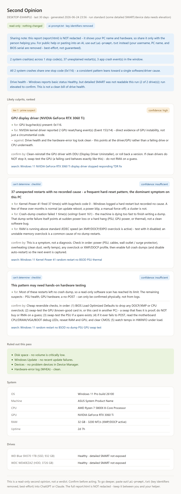

# Second Opinion

**Read-only Windows crash triage for BSODs, random restarts, WHEA errors, GPU TDRs, and drive/device clues.**


One read-only pass over the signals that actually matter — crash/bugcheck history, unexpected-restart and
hardware-error events, drive health, app crashes, problem devices — fused into a **confidence-tiered list of
likely culprits, each with evidence for and against.** It then hands you two files:

1. **`report.html`** — a self-contained report for you or the person helping you. It is **not redacted**
   (it shows the PC name and hardware), so share it only with your helper, never publicly.
2. **`ai-prompt.txt`** — a ready-to-paste AI prompt with **key identifiers removed on a best-effort basis**
   (username, PC name, BIOS serial, network addresses, Windows profile path names, and raw device display names
   that may carry personal labels — still not a guarantee). This is the one safe to paste into ChatGPT / Claude.

Built for the person doing the helping. The friend with the broken PC just runs it (or you run it for them
over Quick Assist) and sends back a file.

### See what it produces — before you run anything

[](docs/sample-report.html)

> Synthetic data (fake PC name and user), a real-shaped result. Click the image for the live `report.html`.

- **[`docs/sample-report.html`](docs/sample-report.html)** — download it and open in a browser. Synthetic
  data (fake PC name, fake user), a real-shaped result: a GPU-driver culprit ranked tier-1, the dump-less
  restarts kept as an honest checklist, evidence for/against, and the cheapest "confirm by" step.
- **[`docs/sample-ai-prompt.txt`](docs/sample-ai-prompt.txt)** — exactly what gets pasted into an AI, with
  identifiers already removed.

## Run it (the 60-second way)

For the person with the broken PC — no command line needed:

1. **Download** this repo as a ZIP (green **Code** button → *Download ZIP*), or grab a release ZIP.
2. **Extract All** (right-click the ZIP → *Extract All*).
3. **Double-click `Run Second Opinion.cmd`**.
4. Wait — a report opens in your browser in a few seconds.
5. **Send `report.html` only to a trusted helper.** When you want AI help, share **`ai-prompt.txt`** instead
   (it's the redacted one).

<details>
<summary><b>Advanced / manual run (PowerShell)</b></summary>

```powershell
# From the project folder, in Windows PowerShell:
powershell -ExecutionPolicy Bypass -File .\src\Invoke-SecondOpinion.ps1 -OpenReport
```

Options:
- `-Days <n>` — how far back to look (default 30).
- `-OutDir <path>` — where to write the report (default `.\out`).
- `-OpenReport` — open the HTML report when done.
- `-NoRedact` — leave the AI prompt un-redacted (off by default; redaction is on).
- `-WhatItReads` — *(optional)* print a categorized list of every source the tool reads (event logs, CIM/WMI
  inventory, storage/device queries, the read-only registry key, the bundled bugcheck KB), then exit without
  collecting or writing anything — the honest "what does this touch before I trust it?" preview.
- `-DeepDump` — *(optional, advanced)* if a crash dump exists, parse it read-only with locally-installed
  debugging tools (no downloads) to name the faulting module as **weak corroborating evidence** — it never
  changes the ranking.
- `-HelperPacket` — *(optional)* also write a shareable, always-redacted **case packet** to `out\packet\` (a
  forum/Discord-safe summary, a schema-versioned evidence JSON, a redaction audit, and an unreadable-signals
  list), each stamped with the tool version + KB hash.
- `-Baseline <path>` — *(optional)* compare this run against a saved `redacted-evidence.json` from a prior run
  and add a **"what changed since the baseline"** section (notes only — it never changes the ranking; honest
  when the baseline is missing or unreadable).
- `-PerformanceSmokeTest` — *(optional)* a read-only, stability-adjacent scan of existing event logs for
  CPU firmware-throttling and low-memory pressure. Not a benchmark, not an optimizer, not a temperature check;
  surfaces only as weak/corroborating evidence and never changes the ranking. A clean scan is not a clean bill.

**Or run it as a single file:** `src/Invoke-SecondOpinion.ps1` is self-contained (it embeds the bugcheck
knowledge base), so you can download just that one file and run it from any terminal — no folder, nothing to
install:

```powershell
powershell -ExecutionPolicy Bypass -File .\Invoke-SecondOpinion.ps1
```

Run it in an **elevated** PowerShell for the deeper SSD/device detail; a standard window works too and the
report says what it couldn't read. A standalone run writes `out/` next to the script.

</details>

## Verify your download (optional)

Every tagged [release](https://github.com/EvilHumphrey/Second-Opinion/releases) ships a named
**`SecondOpinion-<version>.zip`** alongside a **`SHA256SUMS.txt`**. To confirm the ZIP arrived intact and
untampered, save both into the same folder and run this in PowerShell — it prints **OK** or **MISMATCH**:

```powershell
$zip  = 'SecondOpinion-v0.4.1.zip'                       # the file you downloaded
$want = (Get-FileHash $zip -Algorithm SHA256).Hash       # its actual SHA-256
if ((Get-Content .\SHA256SUMS.txt) -match "(?i)^$want\s") { "OK: $zip matches SHA256SUMS.txt" }
else { "MISMATCH - re-download; do not run $zip" }
```

Prefer to eyeball it? Run `Get-FileHash .\SecondOpinion-v0.4.1.zip -Algorithm SHA256` and check the printed
hash appears in `SHA256SUMS.txt`. A mismatch means a corrupted or interfered-with download — fetch it again.

## What it touches (and what it never touches)

| | |
|---|---|
| **Reads** (read-only) | Event Log crash / bugcheck / Kernel-Power-41 / WHEA / TDR / app-crash events; device status; drive SMART & reliability counters; volume free space; crash-dump policy |
| **Writes** | `report.html` + `ai-prompt.txt` into the output folder you choose (default `.\out`); with `-HelperPacket`, also the share-safe `out\packet\` files. Nothing else |
| **Sends** | nothing — no network, ever. The AI step is *you* pasting a prompt into your own AI |
| **Does NOT read** | your documents, browser history, emails, or personal files |

```
Collect locally  ->  Score deterministically  ->  Write report + redacted prompt  ->  You choose where to paste
```

## What makes it different

- **It ranks, and it shows its work.** Every culprit comes with evidence *for*, evidence *against*, and the
  single cheapest reversible step to confirm it.
- **It is honest when it doesn't know.** A restart with no recorded cause becomes a checklist, not a fake
  verdict; blank SMART data is never reported as "healthy." It abstains rather than guess on thin evidence.
- **It changes nothing.** No fixes, no "optimizing," no settings touched. Nothing to undo.

### vs. the tools you'd otherwise reach for

| Tool | Strength | Gap this fills |
|---|---|---|
| **BlueScreenView** | great minidump table | dump-focused; driver attribution can be noisy |
| **WhoCrashed** | friendly automatic dump analyzer | still primarily dump/driver oriented |
| **Reliability Monitor** | useful timeline | not a cross-signal *ranked* handoff |
| **Second Opinion** | correlates bugchecks, dump-less restarts, WHEA, GPU/TDR, storage, devices, app crashes & drive/dump policy; **ranks with honest abstention**; emits a helper/AI handoff | — |

## Who runs what

- **I'm the one with the crashing PC:** run it (the 60-second way above), send the file(s) your helper asks for.
- **I'm helping someone else:** have them run it and send you `report.html` (open it privately — it's
  unredacted) and/or `ai-prompt.txt` (the redacted one you can paste into an AI).

## Requirements

- Windows 10 or 11. Targets **Windows PowerShell 5.1** (ships with every Windows) and also runs on
  PowerShell 7+. **Nothing to install.**
- No administrator rights for the core run; a few detailed signals (SSD wear, some device problem codes)
  populate only when run elevated — and the report says exactly what it couldn't read.

## What it collects

All read-only, all local — it reads (never writes) these and fuses them into the ranking:

- Crash / bugcheck history and unexpected-restart (Kernel-Power 41) events from the Event Log.
- Hardware-error (WHEA) events, display-driver timeout (TDR) events, and GPU vendor reset events.
- Physical-disk SMART / reliability counters, volume free space, and the crash-dump policy.
- Problem devices from Device Manager and application-crash events.
- Optionally, your answers to a short symptom questionnaire (stored as integer codes — no free text).

## Privacy & what's safe to share

The top-level **`out\report.html`** is **unredacted** (PC name + hardware) — for your trusted helper only, never
public. For anything public — an AI, a forum, Discord, GitHub, screenshots — share the **redacted packet** instead.

- **Safe to share:** `out\ai-prompt.txt`, and the `-HelperPacket` bundle in `out\packet\` — a **redacted
  `report.html`** plus `helper-summary.md`, `redacted-evidence.json`, `redaction-audit.txt`,
  `unreadable-signals.txt`.
- **Don't post publicly:** the top-level **`out\report.html`** (the unredacted local report), the whole `out`
  folder, screenshots of the unredacted report, or anything you haven't checked for personal details.

Redaction is **best-effort, not a guarantee** — for public sharing, use the redacted packet (the `-HelperPacket`
bundle now includes a share-safe `report.html`). Found an identifier that survives into the redacted artifacts?
That's a bug worth reporting — see [`SECURITY.md`](SECURITY.md) (please don't paste the surviving identifier into
a public issue).

## Known limitations (v0, on purpose)

- Best-effort redaction is **not** a guarantee — a user-named device or app can slip through.
- The redacted share-safe `report.html` (in the `-HelperPacket` bundle) is best-effort redacted, not guaranteed
  — like `ai-prompt.txt`. The top-level `out\report.html` stays unredacted (local/helper-only).
- No AI inside the tool — *you* paste the prompt into your own AI (keeps it free, private, offline-capable).
- No full minidump stack analysis — it reasons over event/signal *patterns*. The optional `-DeepDump` flag adds
  read-only faulting-module attribution as weak evidence, but not WinDbg `!analyze` root-causing.
- Some SMART / device detail needs an elevated run.
- With no crash dumps, it may produce a "capture the next crash" checklist rather than a verdict.

## Trust the ranking (run the tests)

The scorer is deterministic and guarded by a fixture harness — 51 snapshot fixtures plus 308 guardrail
assertions that must always hold (e.g. *a single GPU bugcheck is never tier-1*, *blank SMART is never
"healthy"*, *dump-less restarts never reach High*, *real-but-sub-threshold signals never read as "clean"*,
*a corroborator like a SMART warning is never a lone verdict*, *a hostile device name can't inject HTML or
AI-prompt instructions*). Run them yourself:

```powershell
powershell -NoProfile -ExecutionPolicy Bypass -File .\tests\Run-Fixtures.ps1
```

The scripts are also linted on every push with PSScriptAnalyzer ([`.github/workflows/lint.yml`](.github/workflows/lint.yml)).
Its settings statically enforce the Windows PowerShell 5.1 compatibility the tool depends on - syntax,
commands and their parameters, and .NET types - so a PowerShell-7-only construct can't slip into a tool
that has to run on 5.1.

Architecture and the abstention/guardrail rationale live in [`docs/DESIGN.md`](docs/DESIGN.md);
contributors, see [`CONTRIBUTING.md`](CONTRIBUTING.md).

## FAQ

**Which file do I paste into an AI or send to a helper?** The redacted text packet — `out\ai-prompt.txt`, or
the `out\packet\` files if you ran with `-HelperPacket`. Not `report.html`.

**Can I post `report.html` publicly?** No — it's the full unredacted report (PC name + hardware). For public
help, forums, Discord, GitHub, or screenshots, use the redacted packet instead.

**Is this a WinDbg / Sysinternals replacement?** No. It's a ranked pre-triage handoff that gives a human the
honest short list and the cheapest confirm step — it doesn't replace deep debugging or a forum collector package.

**Why does it sometimes say "inconclusive" instead of naming a culprit?** Because guessing is worse than
abstaining. It says what it could read, what it couldn't, and what to capture next — it won't turn one weak clue
into a verdict or send you to RMA hardware on a guess.

**What does it read, and what does it never do?** It reads local Windows diagnostic signals (crash history,
restart and hardware-error events, drive health, devices, app crashes, dump policy) and **never** installs
anything, changes settings, edits the registry, uploads files, or contacts a server. Run `-WhatItReads` to see
the full read list before trusting it; delete the `out` folder when you're done if you don't want to keep it.

## Troubleshooting

- **"Running scripts is disabled" / ExecutionPolicy:** use the exact command above — it includes
  `-ExecutionPolicy Bypass` for that one run and does not change your system policy.
- **A "Windows protected your PC" (SmartScreen) prompt:** it's an unsigned script from the internet —
  *More info → Run anyway* if you trust the source (the whole thing is one readable file).
- **The window flashes and closes:** run it from an already-open PowerShell window (the manual command) to
  read any message.
- **"No crashes found":** good news — it still flags restarts, low disk space, problem devices, etc., or
  tells you it came back clean.
- **"Where's the report?":** in the `out` folder next to the script (it also opens automatically).
- **Run as admin?** Not required. Elevating just fills in SSD-wear / some device details; the report says
  what it skipped.
- **Delete it afterward?** Yes — it installs nothing; delete the folder and you're done.

## License

MIT — see [`LICENSE`](LICENSE). Provided as-is, without warranty.

## Status

v0 — terminal-only, runnable, and tested. Issues and PRs welcome.
